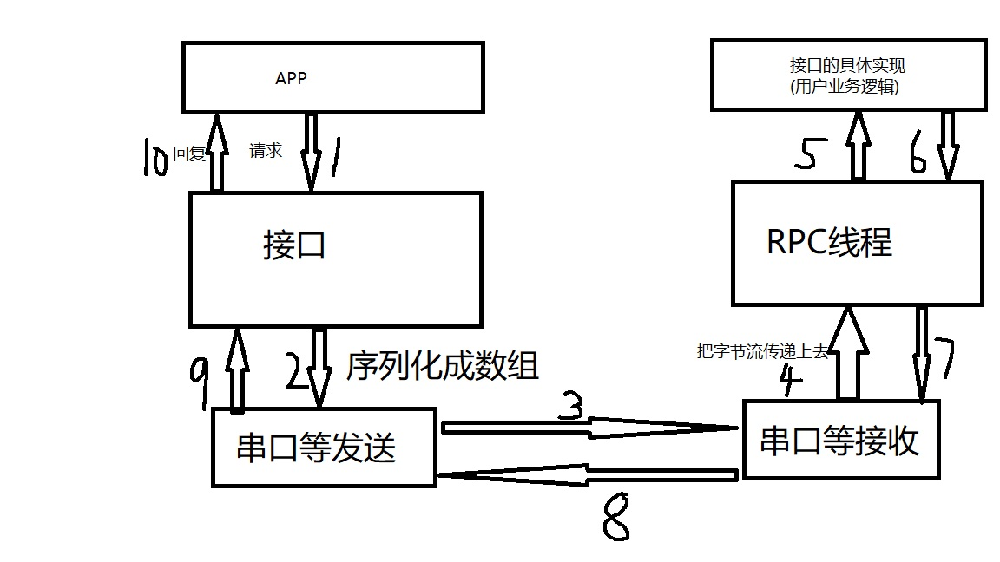
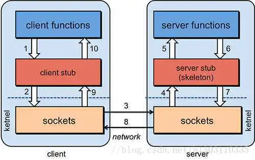

# EmbedXrpc 用户手册
### [EmbedXrpc发行版下载](https://gitee.com/snikeguo/EmbedXrpc/releases/)
# QQ群134161401
#### 这个东西类似于Google的GRPC,但是应用场景是单片机。RPC远程调用极大的方便了开发，使得不必关注于协议解析，数据的序列化和反序列化等繁琐的工作。可是目前还没有在单片机上实现好用的RPC框架，于是我就谋生了做这个RPC框架的想法，所用的技术是：C#做 IDL语言+csscript+自己实现序列化和反序列化+代码生成
#### 应用场景：单片机近距离Client/Server交互场景（USB、串口、CAN（如J1939 、ISO15765协议等），）只要是流协议都支持
#### Sample1工程是例子！除了main.cpp的代码是手工写的之外，其他的代码都是工具生成的！这是个最简单的例子！
## 详情请看WIKI
### WIKI教程已经写得很清楚，如果还是不懂，还可找我代写IDL文件，V信:snikeguo    适当收费。


#### 一个简单的例子(教程请看WIKI)
1.编写idl文件：demo.cs
```
using System;
using EmbedXrpcIdlParser;

[FileName("demo.cs")]
interface Inter
{
    UInt16 GetValue();
}
[FileName("demo.cs")]
public class OptionProcess:IOptionProcess
{
    public GenerationOption Process()
    {
        GenerationOption option = new GenerationOption();
        option.OutPutFileName = "Demo";
        option.CSharpNameSpace = "Demo";
        return option;
    }
}
```
2.执行命令,生成客户端(电脑端)的代码和服务端代码(这里假定执行命令中,-g参数你写的是all,而不是单独的client和server),接口所示：
```
EmbedXrpcIdlParser.exe -i demo.cs -g all -l cpp-nano -o MyCodeFolder
```

```
//客户端
class InterClientImpl
{
public:
    EmbedXrpcClientObject *RpcClientObject = nullptr;
    InterClientImpl(EmbedXrpcClientObject *rpcobj)
    {
        this->RpcClientObject = rpcobj;
    }
    Inter_GetValue_Response &GetValue();
    void Free_GetValue(Inter_GetValue_Response *response);
};


//----------服务端-----------
class Inter_GetValueService : public IService
{
public:
    uint16_t GetSid() { return Inter_GetValue_ServiceId; }
    Inter_GetValue_Response Response;
    void GetValue();
    void Invoke(SerializationManager &recManager, SerializationManager &sendManager);
};
```

**3.服务端(单片机)这边,你需要编写代码：**
```
EmbedXrpcObject ServerRpcObject(.....);//参数我这里省略了

void Inter_GetValueService::GetValue()
{
    Response.ReturnValue=188;
}

```


**4.客户端(电脑)这边,你需要编写代码：**

```
EmbedXrpcObject ClientRpcObject(....Args...);//参数我这里省略了
InterClientImpl Client(&ClientRpcObject);
auto val=Client.GetValue();//这个函数将会把数据发送到服务器(比如单片机)上
if(val.State==ResponseState_Ok)
{
    UInt16 value=val.ReturnValue;//如果不出意外的话，value的值是188
    //你的代码
}
Client.Free_GetValue(&val);//最后用完val,记得调用接口对应的释放函数,形如： Free_你的接口()
```

至此一个完整的RPC调用就完成了
可以看下我自己项目上实现的
```
auto ThreadsInfo=Dev.Request.GetThreadsInfo();
CheckResponseState(ThreadsInfo);//我自己写的一个宏，就是判断State是否是OK，如果不是OK，就返回错误的，简单辅助宏罢了
printf("...");//打印参数

auto EraseResult=Dev.Request.FlashErase(addr,size);
CheckResponseState(EraseResult);
while(...)
{
  auto WriteResult=Dev.Request.FlashWrite(addr,size,bin);
  CheckResponseState(WriteResult);
}
```
是不是非常方便~~